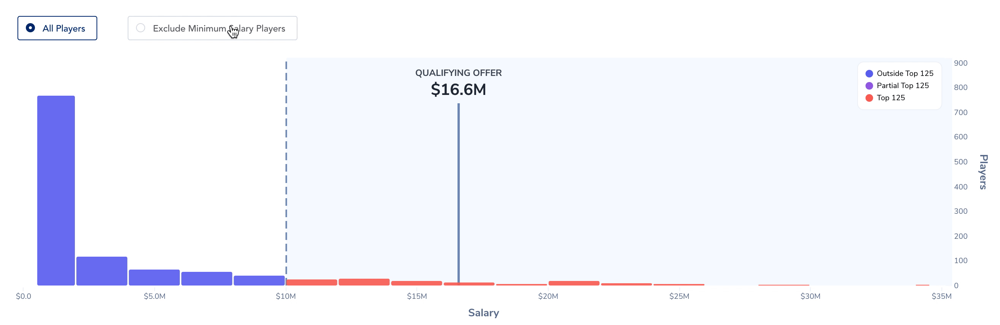
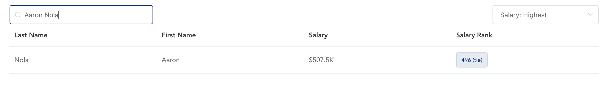
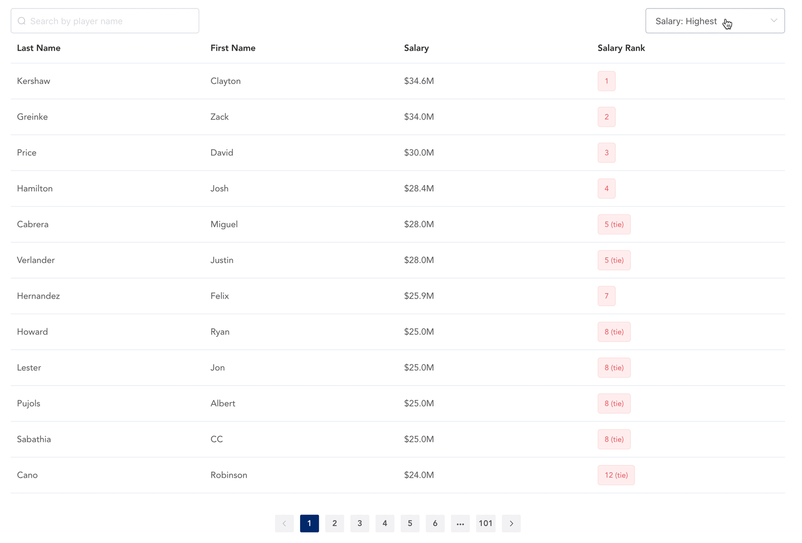

# Phanalytics

Hosted on [phanalytics.app](https://phanalytics.app/). Run locally by following the development instructions in the [client](client/readme.md) and [server](server/README.md) directories.

## Features

### Histogram Overview

An annotated histogram which bins players by salary and separates them into "Top 125" salaries (which contribute towards the qualifying offer) and salaries outside of the top 125. The qualifying offer is marked and labeled. You can hover over the qualifying offer to see the exact amount.

There is a **toggle available to include or exclude minimum salary players.** By excluding this large group, you can better see the breakdown of higher salary players.

### Table View

A full table view of the cleaned data is available, **including salary ranking for each player.** Any player without a salary available will show "Not Available" under salary. The table also provides **search and sort** capabilities.

#### Sample Table Search

#### Table Sorting

## Implementation Overview

A serverless NodeJS function (deployed on AWS Lambda) scrapes and cleans the [external source data](https://questionnaire-148920.appspot.com/swe/data.html).
More server details can be found in [the server documentation](server/readme.md).

The client app is written in VueJS and deployed using Netlify to [phanalytics.app](https://phanalytics.app/). More client details can be found in [the client documentation](client/README.md).
